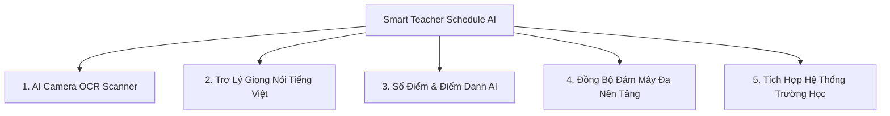

# 📊 BÁO CÁO TỔNG THỂ DỰ ÁN & CHIẾN LƯỢC KINH DOANH
# SMART TEACHER SCHEDULE AI

---

## 📌 THÔNG TIN TỔNG QUAN DỰ ÁN

* **Tên sản phẩm:** **Smart Teacher Schedule AI**
* **Đơn vị phát triển:** **Made in Huy Technology AI**
* **Hotline / Zalo hỗ trợ:** **0961364600**
* **Email liên hệ:** **huytechnologyai2025@gmail.com**
* **Kho mã nguồn chính thức:** [https://github.com/HuyTechonologyAI/SmartTeacherScheduleAI](https://github.com/HuyTechonologyAI/SmartTeacherScheduleAI)
* **Bản phát hành ổn định:** **v1.2.0 (Build 2)**
* **Hệ điều hành hỗ trợ:** Android 8.0 (API 26) đến Android 15/16 (API 35/36), sẵn sàng phát hành trên Google Play Store & Apple App Store.

---

## 🏛️ 1. TỔNG KẾT HỆ THỐNG VÀ CÁC THÀNH TỰU KỸ THUẬT ĐÃ ĐẠT ĐƯỢC

Ứng dụng **Smart Teacher Schedule AI** được xây dựng nhằm giải quyết bài toán cốt lõi của hàng triệu thầy cô giáo: **"Dạy đúng giờ – Làm đúng việc – Không bỏ sót"**. Toàn bộ hệ thống hiện tại đã đạt độ hoàn thiện cao, trải qua quy trình kiểm thử nghiêm ngặt:

### 1.1. Hệ thống Quản lý Lịch giảng dạy & Nhiệm vụ Sư phạm
- **Lập lịch trực quan:** Phân loại rõ ràng môn học, lớp phụ trách, phòng học, tòa nhà, tiết học và số tín chỉ.
- **Thao tác nhanh gọn:** Đầy đủ tính năng **Thêm mới, Chỉnh sửa, Xóa** lịch dạy hoặc công việc với xác nhận an toàn, tự động hủy chuông báo khi thay đổi lịch.
- **Theo dõi thông minh:** Tự động phát hiện xung đột lịch, tính toán thời gian di chuyển giữa các phòng học/cơ sở và đếm ngược thời gian đến giờ lên lớp.

### 1.2. Hệ thống Báo thức Chống Quét Ngầm 4 Lớp (OEM Anti-Kill)
Được tối ưu đặc biệt cho các dòng máy Android quản lý pin hung hăng (như Tecno HiOS, Xiaomi HyperOS, Samsung One UI, Oppo ColorOS):
- **Lớp 1 (Exact Alarm Engine):** Sử dụng `AlarmManager.setExactAndAllowWhileIdle()` kết hợp cờ `FLAG_SHOW_WHEN_LOCKED` và `FLAG_TURN_SCREEN_ON`.
- **Lớp 2 (Foreground Service Audio):** Tự động phát âm thanh chuông báo chuẩn cả khi điện thoại tắt màn hình hoặc chuyển chế độ im lặng.
- **Lớp 3 (Boot & Time-Change Receiver):** Tự động tái lập trình toàn bộ báo thức ngay khi điện thoại khởi động lại hoặc đổi múi giờ.
- **Lớp 4 (OEM Reliability Center):** Trung tâm hướng dẫn người dùng khóa app trong đa nhiệm và bỏ qua tối ưu hóa pin chỉ với 1 chạm.

### 1.3. Tiện ích Màn hình chính Đột phá (Interactive 2-in-1 Widget)
- **Thiết kế tích hợp 2 mục:**
  - *Mục 1 (Lịch dạy tiếp theo):* Hiển thị tên môn, phòng học, lớp và đồng hồ đếm ngược trực tiếp.
  - *Mục 2 (Việc cần làm):* Hiển thị các đầu mục công việc, hạn nộp đề thi, sổ điểm gần nhất.
- **Chuẩn hóa RemoteViews:** Khắc phục triệt để lỗi `"Không thể tải tiện ích"` trên Android 15 bằng cách thay thế toàn bộ thành phần sang các thẻ chuẩn tương thích launcher (`FrameLayout`, `ImageView`, `TextView`), nạp đồng bộ tức thì qua `goAsync()`.
- **Nút làm mới 1 chạm:** Cho phép giáo viên cập nhật lịch dạy ngay trên màn hình chính mà không cần mở ứng dụng.

### 1.4. Trí tuệ Nhân tạo Google Gemini AI
- Tự động đọc và phân tích thời khóa biểu từ văn bản tự do, tin nhắn zalo của tổ trưởng hoặc bảng phân công chuyên môn.
- Đánh giá rủi ro sư phạm (ví dụ: trùng ca dạy, khoảng cách di chuyển giữa 2 phòng học quá gần không kịp nghỉ).

### 1.5. Tích hợp Ngoại vi & Bảo mật Dữ liệu
- **Google Calendar Sync 2 chiều:** Đồng bộ lịch họp khoa, lịch công tác với lịch Google.
- **Telegram Bot Integration:** Tự động gửi tin nhắn báo lịch giảng dạy vào mỗi 6h30 sáng cho giáo viên qua Telegram cá nhân.
- **Offline-First & Sao lưu:** Dữ liệu lưu an toàn trong máy (Room SQLite), hỗ trợ xuất dữ liệu ra file **JSON** và bảng tính **CSV/Excel**.

---

## 🚀 2. GỢI Ý LỘ TRÌNH NÂNG CẤP ĐỘT PHÁ (FEATURE ROADMAP)

Để đưa **Smart Teacher Schedule AI** từ một ứng dụng quản lý lịch cá nhân trở thành **Hệ sinh thái Trợ lý Giáo dục số 1 tại Việt Nam**, dưới đây là 5 hướng nâng cấp mang tính chiến lược cao:



### 🎯 Gợi ý 1: AI Camera OCR Scanner (Quét Thời khóa biểu bằng Camera)
* **Ý tưởng:** Đầu mỗi học kỳ, giáo viên thường nhận file ảnh chụp thời khóa biểu, file Excel hoặc file PDF từ Phòng Đào tạo/Ban Giám hiệu.
* **Giải pháp công nghệ:** Tích hợp Camera quét trực tiếp. AI (Gemini Vision / ML Kit) tự động quét ảnh chụp bảng thời khóa biểu, nhận diện ma trận các ô Thứ/Tiết/Phòng/Môn và **tự động điền toàn bộ lịch cho cả học kỳ chỉ trong 3 giây**.
* **Giá trị mang lại:** Tiết kiệm 100% thời gian gõ thủ công từng tiết dạy, tạo hiệu ứng "Wow" mạnh mẽ khi giới thiệu sản phẩm.

### 🎙️ Gợi ý 2: Trợ lý Giọng nói Tiếng Việt Tự nhiên (Voice Assistant)
* **Ý tưởng:** Giáo viên thường xuyên bận tay khi đang lái xe đến trường, đang làm việc trong xưởng thực hành hoặc đang đứng trên bục giảng.
* **Tính năng:**
  - Nhận diện câu lệnh giọng nói: *"Hôm nay tôi dạy ở phòng nào?", "Tiết tiếp theo lúc mấy giờ?", "Thêm việc: Chiều mai 14h nộp đề thi môn CNC"*.
  - AI phản hồi bằng giọng nói Tiếng Việt truyền cảm, tự động tạo lịch nhắc mà không cần chạm vào màn hình.

### 📋 Gợi ý 3: Sổ tay Giáo án & Điểm danh / Chấm điểm Thông minh
* **Ý tưởng:** Mở rộng từ quản lý thời gian sang quản lý công tác sư phạm trên lớp.
* **Tính năng:**
  - **Điểm danh nhanh:** Bằng cách gọi tên hoặc quét mã QR trên thẻ học sinh.
  - **Nhắc nhở giáo án:** Đính kèm file giáo án điện tử (PowerPoint, PDF, Word) trực tiếp vào từng tiết dạy. Khi chuông báo giờ dạy reo, nút *"Mở giáo án"* hiện ngay để giáo viên trình chiếu lên máy chiếu/màn hình tương tác.

### ☁️ Gợi ý 4: Đồng bộ Đám mây Đa nền tảng (Cloud Sync & Web Portal)
* Xây dựng hệ thống tài khoản đám mây (Google Login, Apple ID, Zalo Login).
* Đồng bộ thời gian thực giữa **Điện thoại Android, iPhone (iOS), Máy tính bảng (iPad/Tablet) và Trình duyệt Web máy tính**.
* Giáo viên có thể nhập lịch trên máy tính bàn ở cơ quan và điện thoại sẽ tự động cập nhật ngay lập tức.

### 🏫 Gợi ý 5: Kết nối trực tiếp hệ sinh thái Quản lý Trường học (LMS / SIS)
* Hỗ trợ API nhập dữ liệu từ các phần mềm giáo dục phổ biến tại Việt Nam như: **VnEdu, SMAS, Moodle, Canvas, Google Classroom, Microsoft Teams Education**.

---

## 💰 3. CHIẾN LƯỢC KINH DOANH & MÔ HÌNH THU PHÍ TỐI ƯU HÓA LỢI NHUẬN (MONETIZATION STRATEGY)

Để tạo ra dòng tiền bền vững và lợi nhuận cao mà vẫn giữ chân được người dùng trung thành, mô hình khuyến nghị là **Freemium + B2B School Licensing**.

### 3.1. Phân tầng Gói Dịch vụ (Tier Pricing Strategy)

| Tính năng | Gói MIỄN PHÍ (Free) | Gói CÁ NHÂN VIP (Teacher Pro) | Gói TRƯỜNG HỌC / KHOA (School B2B) |
| :--- | :---: | :---: | :---: |
| **Quản lý lịch dạy & việc cần làm** | ✅ Không giới hạn | ✅ Không giới hạn | ✅ Không giới hạn |
| **Báo thức chống quét ngầm 4 lớp** | ✅ Có | ✅ Có | ✅ Có |
| **Widget Màn hình chính 2-in-1** | ✅ Có | ✅ Nhiều giao diện VIP | ✅ Có logo riêng của trường |
| **AI Quét TKB từ Camera (OCR)** | ❌ Giới hạn 3 lần/kỳ | ✅ **Không giới hạn** | ✅ Không giới hạn |
| **Trợ lý AI Soạn giáo án & Đề thi** | ❌ 5 câu hỏi/tháng | ✅ **Không giới hạn (Gemini Pro)** | ✅ Thư viện đề thi chuẩn |
| **Tự động gửi Telegram / Zalo Bot** | ❌ Cơ bản | ✅ **Nâng cao + Tùy chỉnh mẫu tin** | ✅ Gửi đồng loạt cho GV & HS |
| **Sao lưu Đám mây (Cloud Sync)** | ❌ Cục bộ (JSON/CSV) | ✅ **Tự động đa thiết bị** | ✅ Quản lý tập trung |
| **Xuất báo cáo giờ dạy cho Khoa** | ❌ Bảng tính đơn giản | ✅ Báo cáo thống kê chi tiết | ✅ **Bảng thanh toán vượt giờ chuẩn** |
| **Hỗ trợ kỹ thuật ưu tiên** | Cộng đồng | 1-1 qua Zalo (0961364600) | Kỹ thuật viên hỗ trợ tận nơi/Online |
| **MỨC GIÁ DỰ KIẾN** | **0 VNĐ (Mãi mãi)** | **29.000 đ / tháng**<br>*(hoặc **299.000 đ / năm**)* | **50.000 – 100.000 đ / GV / năm**<br>*(Hợp đồng trường 10 - 50 triệu/năm)* |

---

### 3.2. Các Dòng Doanh Thu Bổ Sung (Value-Added Revenue Streams)

1. **Quảng cáo Thân thiện (Non-intrusive Native Ads - Dành cho bản Free):**
   * Đặt banner tài trợ nhẹ nhàng từ các nhà xuất bản sách giáo khoa, hãng thiết bị trợ giảng (máy chiếu, bút trình chiếu, máy tính Casio), hoặc các khóa học nâng cao nghiệp vụ sư phạm.
   * *Ưu điểm:* Tạo doanh thu thụ động từ lượng người dùng miễn phí khổng lồ.
2. **Kho Tài nguyên Giáo án & Đề thi Số hóa (Marketplace):**
   * Tạo sàn trao đổi giáo án, đề thi chất lượng cao đã kiểm duyệt. Giáo viên bán giáo án thu tiền, nền tảng trích hoa hồng 15 - 20%.
3. **Dịch vụ SMS Brandname & Zalo ZNS Thông báo:**
   * Cung cấp gói tin nhắn SMS/Zalo thông báo đổi lịch học khẩn cấp trực tiếp đến phụ huynh/học sinh (thu phí theo số lượng tin nhắn nạp theo gói).

---

## 📈 4. DỰ BÁO DOANH THU KỲ VỌNG TẠI THỊ TRƯỜNG VIỆT NAM

### 4.1. Quy mô thị trường (TAM - SAM - SOM)
* **Tổng thị trường (TAM):** Toàn quốc có hơn **1.6 triệu cán bộ, giáo viên, giảng viên** từ mầm non, phổ thông đến đại học/cao đẳng và các trung tâm đào tạo nghề.
* **Thị trường mục tiêu (SAM):** Khoảng **800.000 giáo viên** cấp THCS, THPT, Giáo dục thường xuyên, Cao đẳng và Đại học (nhóm đối tượng có lịch dạy xoay ca, nhiều môn học, nhiều cơ sở đào tạo nhất).
* **Mục tiêu tiếp cận khả thi (SOM):** Đạt 5% thị trường tương đương **40.000 giáo viên** sử dụng app thường xuyên trong 2 năm đầu.

### 4.2. Kịch bản Doanh thu Dự kiến (Năm thứ 2)

```
┌────────────────────────────────────────────────────────────────────────┐
│                        KỊCH BẢN DOANH THU DỰ KIẾN                      │
├───────────────────────────────┬─────────────────┬──────────────────────┤
│ Nguồn Doanh Thu               │ Số lượng        │ Doanh thu / Năm      │
├───────────────────────────────┼─────────────────┼──────────────────────┤
│ 1. Gói Cá nhân Pro (B2C)      │ 10.000 người    │ 2.990.000.000 VNĐ    │
│    (299.000 đ/năm)            │                 │                      │
│ 2. Hợp đồng Trường học (B2B)  │ 30 trường học   │ 1.200.000.000 VNĐ    │
│    (Trung bình 40 tr/trường)  │                 │                      │
│ 3. Doanh thu Tài trợ & Quảng  │ 30.000 Free user│   360.000.000 VNĐ    │
│    cáo thiết bị giáo dục      │                 │                      │
├───────────────────────────────┴─────────────────┼──────────────────────┤
│ TỔNG DOANH THU DỰ KIẾN NĂM 2:                   │ 4.550.000.000 VNĐ    │
│ (Bốn tỷ năm trăm năm mươi triệu đồng)           │ (~$180,000 USD/năm)  │
└─────────────────────────────────────────────────┴──────────────────────┘
```

---

## 🛠️ 5. KẾ HOẠCH HÀNH ĐỘNG KỸ THUẬT ĐỂ TRIỂN KHAI THU PHÍ

Để sẵn sàng tích hợp cổng thanh toán và thu phí trong các phiên bản cập nhật tới, kiến trúc cần chuẩn bị:

1. **Tích hợp Google Play Billing Library (In-App Purchase):**
   * Cho phép người dùng đăng ký gói tháng hoặc gói năm trực tiếp qua tài khoản Google Play (thanh toán qua MoMo, thẻ tín dụng hoặc tài khoản SIM điện thoại Viettel, VinaPhone).
2. **Tích hợp Cổng thanh toán Quốc nội (VietQR / ZaloPay / MoMo):**
   * Tạo mã QR chuyển khoản tự động quét trong 2 giây (giúp giáo viên không có thẻ tín dụng vẫn kích hoạt bản quyền dễ dàng).
3. **Cơ chế Bản quyền Offline (License Key Engine):**
   * Cho phép cấp mã kích hoạt (Voucher/Code) khi bán sỉ theo trường học hoặc tổ bộ môn.

---

## 📞 6. THÔNG TIN LIÊN HỆ & BẢN QUYỀN

Báo cáo này được chuẩn bị bởi đội ngũ phát triển sản phẩm:
* **Tác giả:** **Made in Huy Technology AI**
* **Số điện thoại / Zalo:** **0961364600**
* **Email:** **huytechnologyai2025@gmail.com**
* **Website / Repo:** [https://github.com/HuyTechonologyAI/SmartTeacherScheduleAI](https://github.com/HuyTechonologyAI/SmartTeacherScheduleAI)

---
*Tài liệu được lưu trữ chính thức tại Desktop máy tính: `BAO_CAO_DU_AN_VA_CHIEN_LUOC_KINH_DOANH_SMART_TEACHER_AI.md`*
